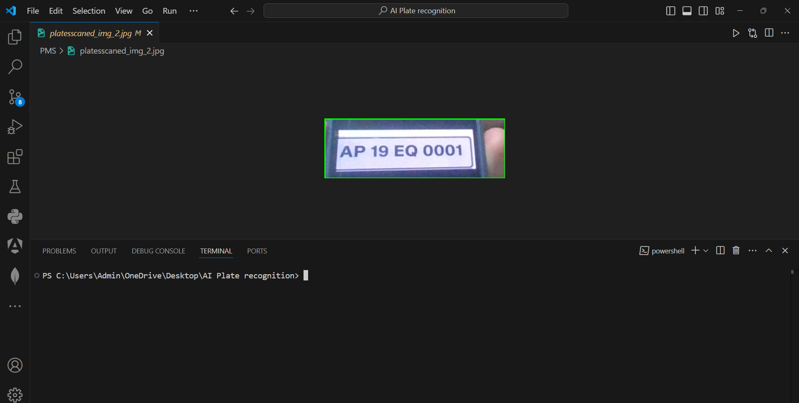

# Overview

ParkEase is an advanced video analytics solution that automates vehicle plate recognition and vacant parking slot detection using cutting-edge AI techniques. The system integrates YOLOv8 for real-time object detection and OpenCV for video processing. Flask is used to create a web interface that allows users to view the live feed of detected plates and parking slots, and it provides a detailed dashboard to track vehicle statuses.

# Tech Stack

**YOLOv8:** For object detection of vehicle plates and parking slots.
**OpenCV:** For video capture and frame processing.   
**Flask:** Backend web framework for serving video streams and managing user interactions.  
**EasyOCR:** For optical character recognition (OCR) to extract text from vehicle plates.  
**HTML,CSS,Bootstrap:** For creating a responsive and user-friendly interface.

# Features
## Plate Recognition System
- Vehicle Plate Recognition: Detects and recognizes vehicle plates using YOLOv8 and OpenCV.
- Vehicle Status Tracking: Tracks the state of vehicles (in/out) and displays it in a user-friendly table.
- User Authentication: Allows users to log in or sign up to access vehicle status information.
- Responsive Dashboard: Displays vehicle data in a table format, including date, time, state (in/out), and plate number.

## Slot Detection System
- Vacant Slot Detection: Detects vacant parking slots in real-time using YOLOv8.
- Live Feed: Shows a live video stream of detected vacant slots in the parking area.
- Real-Time Processing: Processes frames from a connected camera - in real-time to continuously detect changes in slot occupancy.


## API Reference

#### Get Parking Status Dashboard
```http
    GET /dashboard
```

| Parameter | Type     | Description                  |
| :-------- | :------- | :-------------------------   |
| `user_id` | `string` | **Required**. Id of the user |

#### Get Profile

```http
    GET /profile
```
| Parameter | Type     | Description                  |
| :-------- | :------- | :-------------------------   |
| `user_id` | `string` | **Required**. Id of the user |

#### Edit Profile

```http
   PUT /edit-profile
```
| Parameter           | Type     | Description                                   |
| :--------           | :------- | :--------------------------------             |
| `user_id`           | `string` | **Required**. Id of the user                  |
| `profile_data`      | `object` | **Required**. Data to update the profile      |

#### Register Vehicle
```http
    POST /vehicle-registration
```
| Parameter      | Type     | Description                                |
| :--------      | :------- | :-------------------------                 |
| `vehicle_data` | `object` | **Required**. Vehicle registration details |


#### Slot Detection
```http
    GET /video_feed
```
| Parameter | Type     | Description                  |
| :-------- | :------- | :-------------------------   |
| `user_id` | `string` | **Required**. real-time video of parking slot detection. |


## Documentation
#### System Architecture


#### Block Diagram


#### UseCase Diagram


#### Activity Diagram


#### Sequence Diagram


## Installation

- Clone the repository
```
git clone https://github.com/Shashank280804/ParkEase.git
```
- Navigate to the project directory
```
cd my-project
```  
- Install the necessary Python dependencies    
```
pip install Flask OpenCV-python easyocr ultralytics
```
- Run the Flask application:
```
python main.py
```

## Screenshots

#### Scanned Number Plate


#### Dashboard


#### Vehicle Registration


#### Profile


# Usage
#### Vehicle Registration:
Users can register their vehicles through the provided registration interface. The system will store vehicle information, including the plate number, for future recognition.  
#### Plate Recognition:
The system captures video frames using OpenCV, and YOLOv8 is used to detect vehicle plates. EasyOCR then extracts the text from the detected plate for further processing.
#### Slot Detection:
YOLOv8 is also utilized to detect vacant parking slots in real-time by analyzing the video feed of the parking area.
#### Dashboard:
Users can log in to the system and view the status of their vehicles on the dashboard. The dashboard provides:

